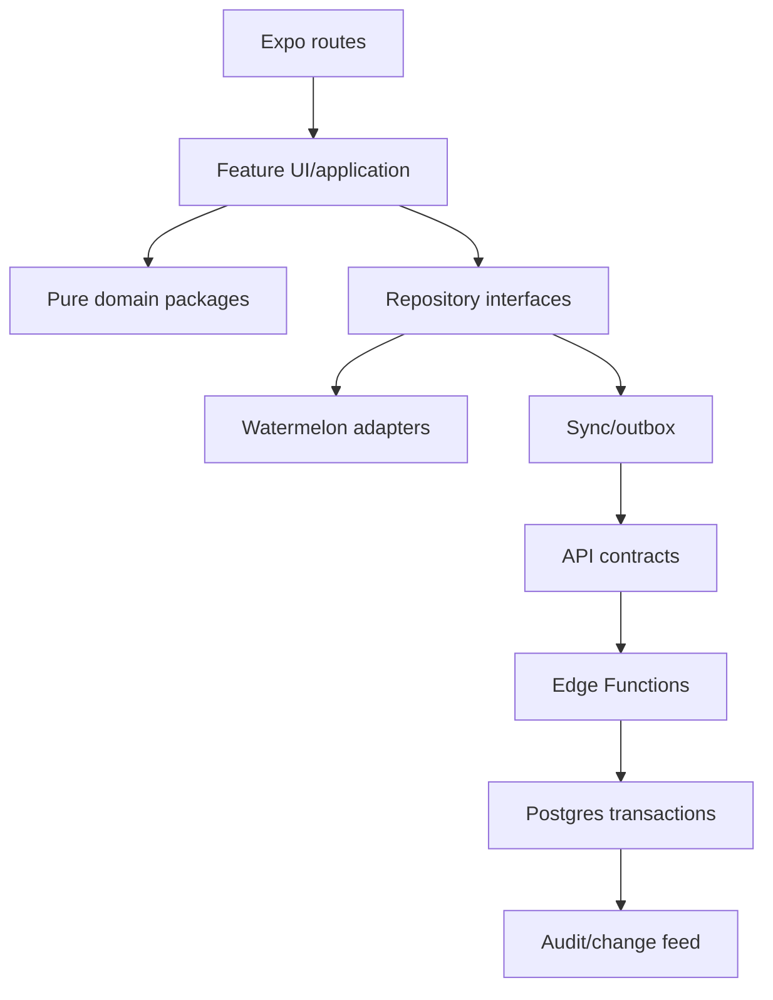
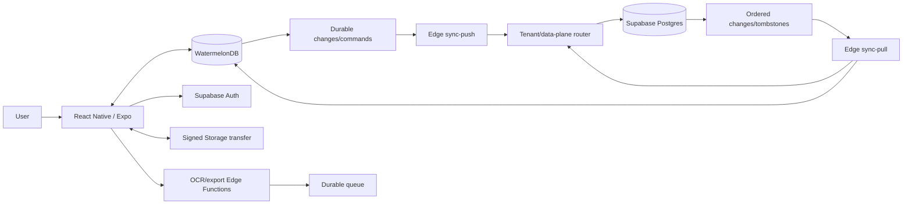

# Khata Refactor — Comprehensive Port and Delivery Plan

> Status: implementation in progress — foundation and first auth/accounting slice landed
>
> Prepared: 2026-07-23
>
> Destination: `khata-refactor/`
>
> Product: offline-first, multi-tenant Nepal SME accounting SaaS
>
> Targets: Android, responsive web, and installable desktop PWA from one React Native/Expo codebase

## 0. Executive decision

Build a new product in `khata-refactor/`; do not incrementally turn the current prototype into the production app.

Use the Obytes Expo/React Native starter as the client baseline, TypeScript everywhere, WatermelonDB as the local operational database, Supabase Auth/Postgres/Storage as cloud infrastructure, and versioned Supabase Edge Functions as the only business API. The only client-to-Supabase exceptions are Supabase Auth session operations and signed Storage uploads/downloads issued by an Edge Function.

The app is local-first: screens read and write local data immediately, and synchronization runs in the background. Postgres remains the multi-device system of record. Draft-like records use server-receipt-order last-write-wins (LWW), as requested. Posted accounting entries, stock postings, period locks, memberships, and audit records are not ordinary LWW rows: they are immutable or changed through explicit server commands because accounting correctness is more important than silently overwriting them.

For the first MVP:

- Android is the primary native target.
- Web is an Expo/React Native Web build with WatermelonDB's LokiJS/IndexedDB adapter.
- “Desktop” is the same responsive web build installed as a PWA. Expo recommends PWAs as a desktop option, and this avoids a second native UI/database adapter in MVP.
- Native Windows is later and gated. React Native Windows plus a WatermelonDB SQLite adapter must pass a compatibility spike before it is promised. Do not add Electron/Tauri only to claim a desktop binary unless distribution requirements prove a PWA insufficient.
- iOS stays build-compatible but is not a release gate unless the product owner adds it.

The current application is a behavioral reference and migration source, not an accounting model to reproduce table-for-table.

## 1. Source audit

### 1.1 Inputs inspected

- Current product notes: [`../PRD.md`](../PRD.md)
- Older documentation shell: [`../index.html`](../index.html)
- Frontend root and orchestration: [`../frontend/src/App.jsx`](../frontend/src/App.jsx)
- Current screens: [`../frontend/src/components/`](../frontend/src/components/)
- Current API: [`../backend/server.js`](../backend/server.js), [`../backend/routes/`](../backend/routes/)
- Current SQLite schema: [`../backend/db.js`](../backend/db.js)
- Current OCR service: [`../backend/services/extractBill.js`](../backend/services/extractBill.js)
- Reusable BS code:
  - `/home/saag/hitech/mobile_report/src/lib/nepali-date/index.ts`
  - `/home/saag/hitech/mobile_report/src/components/ui/nepali-date-picker/bsad-date-field.tsx`
  - `/home/saag/hitech/mobile_report/src/components/ui/nepali-date-picker/bsad-date-picker.android.tsx`
- Existing graphify graph: 159 nodes, 286 edges, 10 communities. Major clusters are authentication/database, employees/benefits, bill OCR, navigation/access, accounting UI, ledger services, and OCR review.

The local SQLite file contains prototype data. Treat it as user data and never overwrite it during the refactor.

### 1.2 Present feature inventory

| Existing area | Current behavior | Port decision |
|---|---|---|
| Authentication | Register/login/logout, custom seven-day sessions, PBKDF2 | Replace with Supabase Auth; never migrate password hashes/sessions |
| Companies | Create/select; tax, fiscal, contact, bank, opening, inventory, security and preference fields | Keep intent; redesign as tenant/settings/fiscal/onboarding data |
| Memberships | Roles plus view/create/edit/delete flags; add registered email | Replace with invitation, role templates, capabilities and RLS |
| Dashboard | Sales, purchases, expenses, profit, stock, staff, charts, activity and client “AI insights” | Keep hierarchy; derive trusted values from journal/stock projections |
| Purchase OCR | Image/PDF, preprocessing, Gemini schema, confidence, reconciliation, review, manual/demo | Keep capture → review → approve; redesign jobs/storage/tax validation |
| Sales OCR | Separate extraction semantics through shared review UI | Keep after purchase OCR is proven |
| Bills | Supplier/PAN/invoice/dates/payment/totals/JSON lines/confidence | Normalize documents/lines; retain source and raw extraction |
| Inventory | CRUD, stock, cost/sell price, reorder; purchase merge/sale deduction | Replace mutable totals with item + immutable movement + projection |
| Sales | Customer/payment/items/discount/tax/COGS/profit/notes/stock check | Keep flow; atomically create document, voucher, allocation, movement |
| Expenses | Date/category/description/amount/list | Keep simple entry; map through payment/journal voucher |
| Employees | Directory CRUD, status, department, phone, join date, salary, notes | Optional clean bounded MVP module |
| Benefits | Types/tax/payment; paid benefit creates expense | Defer posting until voucher link prevents desynchronization |
| P&L | Aggregates sales, expenses and purchases | Replace; financial reports derive from journal lines |
| Audit | Some access/company/backup events | Expand to all sensitive/accounting commands; immutable |
| Backup | JSON snapshot; restore validates only | Replace with backups, tenant export and tested restore |

### 1.3 Defects not to preserve

- No double-entry ledger, accounts, journals, trial balance, balance sheet, allocations, fiscal locks or reversals.
- Money/quantity use SQLite `REAL` and JavaScript floating point.
- Lines and settings are JSON blobs; inventory bulk sync deletes and recreates all rows.
- Authorization is inconsistent middleware; tenant isolation is not database-enforced.
- Tenant selection trusts an `X-Company-Id` context from the client.
- Dashboard “today” values summarize all loaded data; decorative actions do nothing.
- Dates are unvalidated strings; reports sometimes use save time, not transaction date.
- OCR reconciliation can assume 13% VAT without establishing tax treatment.
- Uploads are kept in memory; source retention is undefined.
- No durable offline queue, idempotency, tombstones, migration sync, RLS tests, rate limits, or fault tests.

## 2. Non-negotiable invariants

Put these in `docs/product/INVARIANTS.md` and executable tests. Changing one requires an ADR and accounting/product approval.

1. Every business cloud row has a stable UUID and `tenant_id`.
2. Every local tenant database contains exactly one tenant's data.
3. Slug is routing/display context, never authorization; stable ID + membership authorize.
4. Every posted voucher has at least two lines and equal debit/credit minor-unit totals.
5. Posted vouchers/journal lines are immutable; correction is linked reverse-and-repost.
6. Stock changes only through immutable movements linked to an approved source.
7. Money is integer NPR paisa end-to-end; never ordinary floating-point arithmetic.
8. Quantity/cost use an agreed fixed scale, not binary floating point.
9. OCR never auto-posts in MVP; a human reviews and approves.
10. Original file/hash, provider/model/schema, confidence, corrections and approver are traceable.
11. Repeating one idempotency key cannot post twice.
12. Every exposed tenant table/view/function and Storage path has RLS plus adversarial tests.
13. Revoked users cannot push; preserve rejected local work as an exportable draft.
14. Core entry survives no network and process death/restart.
15. User-facing business dates are BS-first and store a validated derived AD date.
16. Timestamps are UTC; business-day calculations use `Asia/Kathmandu` by default.
17. Disabling a feature cannot silently delete its data.
18. AI suggestions are visibly different from confirmed facts and cannot invent policy.

## 3. MVP boundary

### Required

- Auth/recovery, tenant slug/switching, membership/invites/roles
- Adaptive onboarding and per-tenant feature selection
- Watermelon local DB, durable outbox, sync state/retry/device registration
- Chart of accounts, fiscal periods and opening balances
- Contacts and balances
- Purchase documents: manual plus English printed-bill OCR
- Sales documents: manual first, English OCR after purchase quality gate
- Payment, receipt, contra and journal vouchers
- Inventory items/units/warehouse/movements/weighted cost/low-stock alerts
- Expenses through the voucher engine
- Dashboard, ledger, trial balance, P&L, balance sheet, VAT and stock reports
- Audit, reversals, CSV/XLSX/PDF/JSON export
- BS/AD calendar and offline Roman Nepali → Unicode Devanagari input
- Android, responsive web and installable desktop PWA

### Optional feature pack

- Basic employee directory
- Benefits that link to the same voucher engine when paid

### Later

- Full payroll, manufacturing/BOM, batch/serial stock, native tax filing, bank feeds, payments, POS hardware, multi-currency revaluation, native Windows, voice entry, custom OCR training and AI auto-posting

## 4. Platform and repository

### 4.1 Starter procedure

At implementation start, use the official Obytes scaffold:

```bash
npx create-obytes-app@latest khata-refactor
```

Use its Expo custom development client because WatermelonDB is native; Expo Go is not supported. Record the scaffolder version, generated dependencies and upstream commit in `docs/architecture/STARTER_BASELINE.md`. Pin pnpm and the lockfile. Upgrade intentionally; do not continuously merge starter `master`.

This pass creates only this planning file. Scaffolding is Phase 1 so planning and generated code are not partially mixed.

### 4.4 Implementation ledger (updated 2026-08-02)

#### Execution status — 2026-08-02

Completed in this pass:

- Kept the user-facing product entirely in Expo React Native/React Native Web.
- Made dashboard quick actions and recent-activity navigation actionable through Expo Router.
- Made report cards and export entry point actionable within the RN reports surface.
- Added clear “Open report”/“Manage” affordances to the reports and settings surfaces.

Still open (not represented as complete):

- These navigation affordances currently land on the RN surfaces; repository-backed forms and report queries still require the data layer work below.
- WatermelonDB, durable sync protocol, tenant bootstrap/onboarding, invitations, accounting commands, contacts, inventory, OCR, exports, migration tooling, CI, and release deployment remain implementation phases—not presentation-only work.

Completed:

- Obytes Expo app, pnpm workspace, strict TypeScript, shared contracts and Supabase config exist.
- Initial profile/business/membership migration, membership helper, RLS, and health Edge Function exist.
- Supabase Auth session persistence is now wired into the Zustand auth state and login uses `signInWithPassword`; the starter fake token flow is removed.
- A first accounting migration adds immutable voucher/voucher-line storage, tenant read policies, idempotency uniqueness, and a server-side balanced `post_voucher` command.
- A durable AsyncStorage/MMKV-backed offline command queue exists as the temporary repository boundary for post-voucher commands.
- Accounts and fiscal periods migration added, including tenant-scoped read policies, account foreign-key validation, and an open-period guard for voucher dates.
- Contract tests added for balanced and unbalanced voucher validation.
- Added tenant-safe account bootstrap and opening-balance storage migration (`0004_account_bootstrap.sql`).
- Added a database guard preventing voucher lines from crossing business account boundaries.
- Added idempotent `seed_default_accounts` command with a minimal Nepal SME chart.

Still to do next:

- Replace the temporary queue with the planned WatermelonDB schema, migrations, outbox, tombstones, cursor and retry/conflict protocol.
- Add real business creation/switching onboarding, invitations, role templates, protected routing and feature selection. Current onboarding remains the starter presentation screen.
- Add the authenticated tenant-bootstrap Edge Function that calls account seeding and creates the initial open fiscal period.
- Add opening-balance posting through the voucher engine, including one-time-per-period protection and UI review.
- Add contacts and the remaining accounting constraints (reversals, locks, journal/report projections).
- Validate and apply migrations in a disposable Supabase project; the new fiscal-period trigger requires an open period before posting.
- Add Edge Functions for authenticated tenant bootstrap, sync pull/push and accounting commands; direct RPC usage is only a development bridge.
- Add adversarial RLS tests, domain tests for balance/idempotency, auth tests, and offline restart tests.
- Fix the documented Node 20 lint limitation or pin/use the supported Node runtime in CI.

Completed in this pass (2026-08-02):

- Replaced the starter Feed route with a Khata accounting dashboard for Expo React Native and React Native Web.
- Added Nepalese business summary cards, profit snapshot, quick actions, recent activity, and responsive layout.
- Replaced starter onboarding copy with Khata product messaging; auth/session routing remains intact.

Completed in the current pass (2026-08-02):

- Replaced the starter Reports/style-demo tab with a Khata reports landing screen covering day book, trial balance, P&L, balance sheet, VAT, stock, and export entry points.
- Replaced generic Obytes Settings content with Khata business profile, team, sync, fiscal-year, language/theme, and sign-out entry points.
- Removed the starter Feed/Create header affordance from the authenticated tab shell.
- Added the Reports route to the Expo Router app group so the visible output is fully React Native/React Native Web.

Remaining product work after the visible MVP shell:

- Wire dashboard cards/actions to local repositories and server commands; current values are presentation fixtures pending tenant/bootstrap data.
- Replace Reports and Settings starter routes with ledger, trial balance, P&L, balance sheet, VAT, stock, profile, tenant switching, and sync-status screens.
- Add WatermelonDB persistence, sync, contacts, inventory, sales, purchases, expenses, OCR review, exports, migration tooling, and release CI.

### 4.2 Proposed monorepo

```text
khata-refactor/
├── AGENTS.md
├── PLAN.md
├── README.md
├── package.json
├── pnpm-workspace.yaml
├── apps/
│   └── khata/
│       ├── app/                    # thin Expo Router routes
│       ├── src/features/           # UI/application per feature
│       ├── src/shell/              # adaptive nav, tenant, sync chrome
│       ├── src/platform/           # .native/.web adapters
│       ├── public/                 # PWA manifest/icons
│       └── app.config.ts
├── packages/
│   ├── domain/                     # pure accounting/money/date/stock rules
│   ├── database/                   # Watermelon schema/models/migrations/adapters
│   ├── sync/                       # protocol/orchestrator/conflicts
│   ├── api-contracts/              # shared versioned Zod contracts
│   ├── ui/                         # accessible tokens/primitives
│   ├── nepali-date/
│   ├── nepali-input/
│   ├── i18n/
│   ├── feature-flags/
│   ├── observability/
│   └── test-factories/
├── supabase/
│   ├── migrations/
│   ├── functions/_shared/
│   ├── functions/tenant-bootstrap/
│   ├── functions/sync-pull/
│   ├── functions/sync-push/
│   ├── functions/accounting-command/
│   ├── functions/ocr-submit/
│   ├── functions/ocr-worker/
│   ├── functions/export-submit/
│   ├── functions/export-worker/
│   ├── functions/invitation/
│   ├── functions/admin-tenant-routing/
│   └── tests/
├── docs/
│   ├── README.md
│   ├── product/
│   ├── design/
│   ├── architecture/decisions/
│   ├── data/
│   ├── sync/
│   ├── security/
│   ├── features/
│   ├── api/
│   ├── agents/
│   └── operations/
├── tests/
│   ├── accounting-golden/
│   ├── ocr-fixtures/
│   ├── migration-fixtures/
│   ├── sync-scenarios/
│   └── e2e/
├── scripts/
└── graphify-out/                   # generated artifact, not source of truth
```

### 4.3 Dependency rules



- Routes contain no business logic.
- Shared packages never depend on feature packages.
- Domain code imports no React, Expo, Supabase or Watermelon code.
- Client components do not call Supabase business tables directly.
- Edge handlers stay thin; atomic rules live in reviewed Postgres functions/constraints.
- No cross-feature deep imports; expose a public `index.ts`.
- Avoid catch-all `utils.ts`, `helpers.ts` and giant services/components.

## 5. Runtime architecture and offline matrix



| Capability | Offline | Reconcile online |
|---|---|---|
| First sign-in | Network required | Download tenant bootstrap |
| Reopen cached tenant | Yes, under device/session policy | Refresh auth/sync |
| Browse/search | Fully local | Pull updates projections |
| Create/edit drafts | Immediate local save | LWW push + revision |
| Manual voucher | Draft + local validation | Server validates/posts atomically |
| Post/approve | Queue as “pending post,” never “confirmed” | Accept/reject with reason |
| Document capture | Local private file + hash | Resumable signed upload |
| OCR | Queue capture only | Job runs after upload |
| Reports | Cached/local, marked “as of” + pending count | Reconcile trusted projection |
| Export | Local CSV/JSON; small XLSX if proven | Large/official job |
| Membership/invite | Explain network requirement | Edge Function only |

## 6. Multi-tenancy and data planes

### 6.1 Central registry + pooled MVP + dedicated future planes

Do not create one schema/database per small tenant in MVP. That multiplies every migration, function, policy, index, backup and sync query. Implement the requested central linkage as a control-plane registry now:

```text
control.tenants
  id uuid primary key
  slug citext unique
  display_name text
  status enum(provisioning, active, suspended, migrating, closed)
  plan_id uuid
  data_plane_id uuid
  isolation_mode enum(pooled, dedicated_schema, dedicated_database)
  schema_key text nullable
  region text
  feature_profile_version integer
  created_at/updated_at timestamptz

control.data_planes
  id uuid primary key
  kind enum(supabase_project, postgres_cluster)
  region text
  project_ref text
  secret_ref text             # reference only; never plaintext credentials
  migration_version text
  status enum(active, draining, unavailable)
  capacity_health jsonb

control.tenant_slug_aliases
  tenant_id uuid
  slug citext unique
  retired_at timestamptz nullable
```

MVP tenants share `app` tables with `tenant_id` + RLS. The router interface must not assume one project. Later, a large/regulatory tenant can move to a dedicated database while keeping UUID/slug. Physical databases cannot have cross-database FKs; “linked” means audited registry/provisioning/health reconciliation.

If dedicated schema mode is added, schemas stay private behind Edge Functions and are automatically migrated. Never expose one dynamic PostgREST schema per tenant to clients.

### 6.2 Slug/lifecycle rules

- Lowercase ASCII kebab-case; globally case-insensitive unique; reserve system words.
- Stable UUID remains separate from mutable slug; retain redirect alias and audit rename.
- Resolve slug, then require authenticated membership.
- Never expose data-plane locator or credential to clients.
- Lifecycle: `provisioning → active → suspended/read-only → closing/export-window → deleted-after-retention`.
- Suspension blocks cloud mutation but preserves local draft export.
- Deletion requires ownership reauthentication, final export, retention checks, background status and recovery window.

## 7. Cloud data model

Finalize columns in `docs/data/DATA_MODEL.md` before migrations.

### Control/identity

- `profiles`, `tenants`, `tenant_slug_aliases`, `data_planes`
- `tenant_memberships`, `roles`, `capabilities`, `role_capabilities`, `invitations`
- `devices`, `device_sessions`
- `plans`, `feature_catalog`, `tenant_features`, `usage_counters`
- `audit_events`

### Accounting

- `currencies`, `fiscal_periods`, `accounts`, `account_groups`
- `vouchers`, `journal_lines`, `voucher_reversals`
- `contacts`, `payment_allocations`, `number_sequences`

Voucher state: `local_draft → pending_post → posted` or `rejected`; later `reversed` only by linked reversal. Server assigns final numbers; offline UI uses a temporary draft reference.

### Documents/commerce

- `source_documents`, `document_pages`
- `ocr_jobs`, `ocr_extractions`, `ocr_field_candidates`
- `purchase_documents`, `purchase_lines`
- `sales_documents`, `sales_lines`
- `document_duplicates`, `document_contact_matches`, `document_item_matches`

### Inventory

- `items`, `item_aliases`, `units`, `unit_conversions`, `warehouses`
- `stock_movements`, `stock_balances` projection, weighted cost state, `reorder_rules`

### Optional people

- `employees`, `employee_benefits`, explicit `voucher_id` for paid benefits

### Sync/operations

- `change_log` with tenant-scoped monotonic cursor
- tombstones retained beyond maximum offline interval
- processed command/idempotency ledger
- draft/settings `record_revisions`
- `schema_compatibility`
- `export_jobs`, `export_artifacts`, `import_jobs`, `migration_mappings`, `reconciliation_runs`

Common mutable tenant columns:

```text
id uuid
tenant_id uuid
version bigint
created_at timestamptz
created_by uuid
updated_at timestamptz
updated_by uuid
last_device_id uuid nullable
deleted_at timestamptz nullable
```

Never use `updated_at` as sync cursor; use an ordered server cursor and snapshot boundary.

## 8. Local WatermelonDB design

- One DB per `{environment, auth_user_id, tenant_id}`.
- Android: Watermelon SQLite/JSI.
- Web/desktop PWA: LokiJS incremental IndexedDB with tenant-specific `dbName`.
- Close DB and clear query/feature state before switching tenant.
- A small encrypted registry may remember DB presence/sync state, not business records.
- Wipe credentials on logout; tenant policy decides cache retention vs erase.
- Never use unsafe reset as normal sync repair.

Local-only tables:

- `local_commands`: durable command outbox
- `local_files`: path/hash/upload/retention
- `sync_state`: cursor/schema/lease/last outcome
- `sync_incidents`: redacted support diagnostics
- `draft_validation`: local issues/server rejections
- `saved_filters`, `recent_choices`, `input_dictionary_overrides`

Security:

- Secrets only in platform secure storage, not Watermelon/AsyncStorage.
- Verify encrypted MMKV suitability; otherwise use SecureStore/keystore.
- Database encryption is a mandatory spike; Watermelon does not provide it automatically. Until proven, rely on OS encryption, app lock, minimal local file retention and tenant policy, with residual risk documented.
- Document images use app-private tenant paths and cleanup only after verified upload.
- Logs/screenshots/analytics cannot include images, PAN, bank details, tokens or line text.

## 9. Sync protocol

Write `docs/sync/SYNC_PROTOCOL.md` before the first business feature.

1. Acquire per-tenant sync mutex; never overlap runs.
2. Verify auth, active membership, device, local schema and tenant/data-plane status.
3. Pull authorized changes after cursor up to one stable snapshot cursor.
4. Apply changes/tombstones in one Watermelon batch.
5. Push local changes/commands in bounded batches with idempotency/base version.
6. Server validates tenant, role, feature, record type and invariants.
7. Mutable drafts/settings resolve by server receipt order; preserve displaced revision.
8. Protected aggregates execute a named Postgres transaction or reject stably.
9. Pull again after push-generated rows/projections.
10. Save cursor only after local apply succeeds; release mutex and back off/retry.

Trigger on connectivity regain, foreground, tenant open, debounced local change, realtime/push hint and manual retry. Realtime is a wake-up hint, never consistency truth.

### LWW definition

“Latest” is the last valid server commit, not client timestamp. Client clocks are diagnostic only.

Applies to unposted drafts, contact/item descriptions, preferences/onboarding, saved filters and unposted employee data.

Does not apply to posted vouchers/lines, stock movements/cost, fiscal locks, memberships/roles, audit, number sequences or billing. Those use immutable rows/commands/state machines. Rejected offline commands remain visible with edit-new-draft, retry or export actions.

### Required conflict tests

- Two devices edit one supplier offline: later valid commit wins; prior revision recoverable.
- Delete vs edit on draft follows later valid commit with revision.
- Duplicate voucher command UUID returns one posting.
- Two allocations exceed remaining balance: second rejects.
- Period locks while device offline: pending posting rejects.
- Role revoked offline: queued privileged commands reject.
- Device older than tombstone retention: controlled rebootstrap.
- Tenant moves data plane mid-sync: stable retry/redirect, no duplicate.

### Version/migration sync

- Enable Watermelon migration sync from version 1.
- Each app declares min/max server protocol.
- Cloud additions precede client use; removals wait for supported old clients.
- Stable `upgrade_required` and `rebootstrap_required` responses.
- Every local migration supports interruption and all supported prior versions.
- Page initial sync; evaluate Android-only Turbo Login later (not web).

## 10. Edge Function API

All functions share request IDs, error envelope, Zod validation, auth, routing, rate limits, audit and redacted logs. Contracts live in `packages/api-contracts`, versioned under `/v1`.

| Function | Responsibility |
|---|---|
| `tenant-bootstrap` | Resolve slug, verify membership, return settings/features/protocol/bootstrap |
| `sync-pull` | Watermelon change feed at stable cursor |
| `sync-push` | Batch mutable changes and protected commands |
| `accounting-command` | Post/reverse/lock/allocate with atomic stock/accounting effects |
| `ocr-submit` | Verify metadata/hash/quota, issue upload, enqueue extraction |
| `ocr-worker` | Claim job, call provider, validate/persist candidates |
| `export-submit` | Permission/filter/size validation and job creation |
| `export-worker` | Generate/store/checksum/expire/audit artifact |
| `invitation` | Create/accept/revoke invite and roles |
| `admin-tenant-routing` | Privileged provisioning/migration/data-plane health |

Do not call one Edge Function per local row; sync bounded batches. Functions orchestrate and remain idempotent. Durable Supabase Queues/PGMQ holds OCR/export work; workers checkpoint, cap retries and archive poison jobs. If real workloads exceed Edge limits, retain the queue contract and move only worker implementation through an ADR.

## 11. RLS and security

Private schema plan:

- `control`: tenant/data-plane registry
- `app`: pooled tenant tables, all RLS
- `accounting`: posting functions/constraints/projections
- `security`: authorization helpers
- `sync`: change/idempotency machinery
- `ops`: jobs/migrations/health
- `public`: empty/minimal

Every policy checks authenticated user, active membership matching `tenant_id`, tenant status, operation capability and optional feature entitlement. Index policy predicates.

Security-definer helpers stay in an unexposed schema, set safe empty `search_path`, schema-qualify references and revoke public execute. Edge Functions use a JWT-bound client where RLS should apply. Service-role paths are minimal, audited and independently validate actor/tenant/capability.

Threat tests include cross-tenant UUID/slug guessing, forged tenant body/header, replay, leaked service key, invite takeover/email change, offline revoked access, malformed sync, CSV injection, oversized/decompression/MIME upload attacks, OCR prompt injection, signed URL leakage, unauthorized export, view/function/Storage RLS bypass and incomplete tenant deletion.

## 12. Feature modules

Each feature lives in `apps/khata/src/features/<name>/` with a short README: purpose, routes, public API, local/cloud tables, functions, capabilities, invariants, offline behavior, tests and open decisions. It must be removable from navigation without untangling another feature's internals.

### 12.1 Foundation

1. **Auth** — sign-in/recovery, MFA-ready, secure session.
2. **Tenant** — slug, selection/switching, settings, status/plan.
3. **Membership** — invitation and owner/admin/accountant/operator/viewer templates.
4. **Onboarding** — adaptive questions, feature recommendation, activation checklist.
5. **Sync health** — pending/rejected status, retry and diagnostics.
6. **Feature catalog** — entitlement, navigation and server capability mapping.

### 12.2 Accounting spine

1. Money/quantity/dual-date value objects.
2. Fiscal periods and Nepal-oriented chart of accounts.
3. Voucher aggregate and journal lines.
4. Post/reverse/lock/unlock-with-audit commands.
5. Contact ledgers and payment allocation.
6. Account ledger, trial balance, P&L and balance sheet.

No OCR, inventory automation or dashboard number is production-ready before this spine passes golden tests.

### 12.3 Purchases and OCR

- Camera/gallery/PDF or manual start; immediate local source/draft.
- Hash and local/server duplicate candidates.
- Resumable signed upload and versioned OCR job.
- Source beside editable fields; focus attention only on uncertain/invalid values.
- Suggest supplier/item/account from local history, never silently confirm.
- Explicit VAT inclusive/exclusive/exempt/non-VAT classification; never assume 13% silently.
- Approval queues a post command; server atomically makes document, voucher, tax lines, stock movements and audit.

### 12.4 Sales

- Fast repeated customer/item entry and optional English OCR after purchase quality gate.
- Autofill last payment, price and tax choice, visibly editable.
- Local stock-policy warning; server final authority.
- Cash/credit and partial allocations without changing base document model.
- Shareable invoice/PDF with tenant branding and BS-first date.

### 12.5 Inventory

- Item, SKU/barcode, unit/category, aliases, cost/sell price and preferred supplier.
- One default warehouse in MVP, but warehouse remains explicit.
- Deterministic tested weighted-average cost.
- Tenant-controlled negative stock, never accidental.
- Returns/reversals create movements; never rewrite history.
- Low-stock is a projection; daily requirement is optional metadata.

### 12.6 Expenses

One-screen date, category/account, amount, payment account and optional note/document. Remember recent choices. Save draft locally; post through voucher engine.

### 12.7 Employees and benefits

- Isolated from accounting core and controlled by feature entitlement.
- Disabling hides new use but keeps data readable/exportable.
- Paid benefit links to one voucher; edit/delete cannot orphan/duplicate expense.
- Full payroll remains out.

### 12.8 Reports/dashboard

- Server-validated projections plus visibly separate pending-local effects.
- Labels: `Confirmed`, `Pending sync`, `As of <BS date/time>`.
- All quick actions work; remove prototype decorative controls.
- Deterministic recommendations precede optional LLM summaries and cite their metrics.

## 13. Adaptive onboarding and SaaS entitlements

### 13.1 Short questions

Do not immediately show the current large company wizard. Ask only what changes the product:

1. Business name and optional PAN/VAT/registration scan.
2. Business type: retail, wholesale, service, restaurant, manufacturing-light, other.
3. Track physical stock?
4. Create sales invoices?
5. Customer/supplier credit?
6. Need employee records now?
7. How many users and roles?
8. VAT registered, non-VAT or unsure?
9. UI language and input mode.
10. Confirm defaults: NPR, Asia/Kathmandu, BS-first, current fiscal year.

Recommend a pack, then allow editing. Mandatory accounting/security/audit/export infrastructure cannot be disabled. Store answers separately from entitlements.

```text
feature_catalog(key, version, dependencies, availability, default_config)
tenant_features(tenant_id, feature_key, enabled, config, source, enabled_at, disabled_at)
plan_features(plan_id, feature_key, limits)
```

- Validate dependency graph and prevent cycles.
- Backend checks entitlement even if a route is manually opened.
- Sync enabled modules plus mandatory dependencies.
- Disable makes data read-only/exportable during cooling period, not deleted.
- Plan limits fail clearly before partial posting.

After onboarding, guide one next action: opening cash/bank → confirm accounts → first supplier bill → invite staff. Autosave; let nonessential steps skip. Use plain English/Nepali examples instead of accounting jargon.

## 14. `DESIGN.md` contract

Create `docs/design/DESIGN.md` before feature UI. It must contain:

1. Product design principles and literacy/device constraints.
2. Semantic color, typography, spacing, radii, elevation, motion, breakpoints.
3. English/Devanagari typography and reviewed font/license/bundle choice.
4. Compact phone, tablet, desktop and narrow-web shell specs.
5. Navigation map and feature-disabled behavior.
6. Page/form/table/list and empty/loading/error/offline/conflict states.
7. OCR review and confidence semantics.
8. One-primary-action rule and confirmation policy.
9. Keyboard, screen reader, contrast, 200% text and reduced-motion rules.
10. Performance/motion budget.
11. Critical journey wireframes/screenshots.
12. A “do not do” section preventing design drift.

### Visual direction

Bold/modern means strong hierarchy, large clear totals, confident semantic color, clean surfaces and legible type—not gradients everywhere or desktop ERP tables squeezed onto phones.

- Restrained neutral base + one brand color + semantic status colors.
- Color always paired with text/icon.
- Minimum primary touch target 48×48 dp.
- One obvious primary action per view.
- Avoid unlabeled icon-only actions for novice users.
- Plain labels: “Record sale,” “Money received,” “Needs internet,” “Saved on this device.”
- Examples in first-use states; no hidden sync failure/spinner.

### Adaptive interaction

- Phone: bottom nav for 3–4 enabled daily modules, contextual create, “More.”
- Tablet/desktop: labeled collapsible sidebar, resizable content, shortcuts.
- Desktop PWA: keyboard navigation and command palette; hover is enhancement only.
- Forms: sticky primary action, appropriate keyboard, next-field flow, scan/autocomplete, autosaved draft.
- Long lists: FlashList/virtualization, local search, chips and windowing.

### Fewer presses, without unsafe automation

Prefill today in BS, current period, payment account, recent contact, last tax/payment choice, item unit/price/account mapping, OCR suggestions and business-type defaults. Server assigns final invoice number. Every prefill remains visible/editable. Never auto-post.

## 15. Nepal localization, dates and text

### 15.1 BS-first contract

“Keep dates in BS” is implemented as BS-primary business semantics, not an unqueryable string:

```text
date_bs_year smallint
date_bs_month smallint
date_bs_day smallint
date_ad date                 # derived, validated equivalent
calendar_source enum(bs_input, ad_input, ocr_bs, ocr_ad, migration)
```

AD is required for indexes, ranges, integrations and interoperability. A reviewed conversion path/constraint ensures agreement. UI defaults BS; AD is within one click. Export shows BS first and optional AD.

Reuse `mobile_report` carefully:

- Extract app-independent conversion/formatting to `packages/nepali-date`.
- Port custom BS calendar for Android/web.
- Remove app-specific tokens/imports and fix existing duplicate accessibility prop.
- Replace its AD-only component contract with a typed dual-date value.
- Pin `nepali-date-converter` only after license/range/known-date verification.
- Test every month/year edge, leap variation, supported min/max and Kathmandu midnight.
- Obtain accountant review for fiscal boundaries and known official dates.

Timestamps remain UTC `timestamptz` and display in Asia/Kathmandu. Never convert an instant by assuming device timezone.

### 15.2 Romanized Nepali input

One-click app-shell/input-accessory modes:

- `EN` — Latin input
- `ने` — offline phonetic Roman Nepali → Unicode Devanagari

Requirements:

- `mero` offers/commits `मेरो`, with common business/name fixtures.
- Compose a word and commit on space/choice; backspace can restore Roman source.
- Show 1–3 suggestions, not destructive mid-token conversion.
- Mixed Latin remains available for PAN, SKU, email, phone, brands.
- Store normalized Unicode, never legacy Preeti encoding.
- Curated business dictionary + tenant-local personalized aliases.
- Search both Latin aliases and Devanagari names.
- Low-end Android latency/bundle budget.

Choose no dependency before a spike checks offline quality, Nepali correctness, maintenance, license, RN compatibility and size. Hide it behind `Transliterator`.

### 15.3 i18n

- i18next namespace per feature; Unicode-ready model/UI from MVP.
- No concatenated translated fragments; use full parameterized messages.
- Decide Devanagari numerals independently of language preference.
- Translation lint rejects missing/unused keys.

## 16. OCR/AI boundaries

- English printed purchase bills first; English sales invoices second.
- Devanagari storage/display/search now, OCR experimental until its own evaluation passes.
- Gemini behind `OcrProvider`; no provider SDK/key client-side.
- Store provider/model/prompt/schema, latency, cost and protected raw result.
- Zod + deterministic accounting/tax validation after model output.
- Treat bill text as untrusted data, never instructions.
- Confidence never replaces user approval.

Job flow:

`capture → hash/compress → signed upload → duplicate check → queue → provider → validate → candidates → human review → posting command`

Failures resume. Manual entry can continue without losing source/review. Label values `Confirmed`, `Suggested`, or `Required`. Do not call deterministic rule cards “AI.” Define consent, retention and redaction before pilot.

## 17. Export, backup and portability

### Formats

- CSV: fastest/local, UTF-8 and optional BOM for Excel.
- XLSX: multi-sheet accountant/report handoff.
- PDF: invoices/statements/reports with Devanagari font subset.
- JSON: versioned tenant portability manifest + checksums.
- Tally/IRD-specific formats later after accountant/legal review.

### Experience

- Export from each list/report with current filter.
- Presets: fiscal year, month, all; advanced options second.
- BS-first columns and optional AD companion.
- Include tenant/slug, filters, generation instant, schema, currency and reconciliation status.
- Mobile share sheet; browser download on web/PWA.
- Small cached exports offline; large/authoritative exports queued with progress and expiring URL.
- Audit actor/scope/time, not file content.

### Security/correctness

- Escape spreadsheet cells starting `=`, `+`, `-`, `@`, tab or carriage return.
- Preserve leading zeroes in PAN/phone/invoice.
- Test commas, quotes, newline, Devanagari, large integers and date coercion.
- Exclude internal IDs/secrets by default.
- `data.export` separate from report view.
- Artifact checksum, short expiry and cleanup.
- Backup is not export: backup DB and Storage and prove restore.

## 18. Legacy migration

| Legacy | Target | Rule |
|---|---|---|
| users/sessions | Supabase Auth/profiles | Reinvite/recover; never hashes/tokens |
| companies | tenants/settings/fiscal/onboarding | UUID/slug; normalize JSON; preserve mapping |
| company_users | membership/roles | Explicit mapping; invite acceptance as needed |
| bills | source/purchase/lines/staged voucher | Preserve raw; deduplicate; reconcile before posting |
| sales | sales/lines/staged vouchers/allocations | Convert lines; reconcile contact/stock/revenue |
| expenses | expense draft + payment/journal | Map account/payment; unresolved stays staged |
| inventory_items | items + approved opening movement | Stable aliases; never fabricate history |
| employees | employees | Optional module import |
| employee_benefits | benefit/payroll staging | Reconcile paid rows to legacy expense |
| audit_logs | legacy audit archive | Read-only; new complete stream at cutover |
| company_backups | migration evidence | Not production restore format |

Process:

1. Read-only copy + hash input.
2. Versioned raw-table package.
3. Validate tenant ownership/orphans.
4. Stable legacy→UUID map.
5. Normalize dates/money/JSON to staging.
6. Detect duplicates/unresolved mappings.
7. Propose opening/import vouchers and stock openings.
8. Per-tenant count/total/exception/reconciliation report.
9. Owner/accountant sign-off.
10. Idempotent import and rerun report.
11. Legacy read-only window + rollback.

Never import prototype profit/stock totals as unquestioned accounting truth.

## 19. Delivery phases and gates

Phases are dependency-ordered. Parallel AI work is allowed only inside a phase after contracts stabilize and file ownership does not overlap.

### Phase 0 — Decisions and frozen reference

Deliver:

- Tag/hash legacy baseline and capture workflows/data fixtures.
- Select pilot business segment and platform minimums.
- Accountant decisions: accounts, VAT, fiscal, rounding, returns, locks.
- ADRs: platform, tenant planes, sync, money/quantity, dates, posting, OCR, desktop PWA.
- Privacy, data residency and OCR retention decisions.

Gate: no open decision can alter core schema/posting model.

### Phase 1 — Starter, monorepo and agent memory

- Generate/pin Obytes, create workspace and preserve useful Router/forms/i18n/tests/CI/env patterns.
- Root/feature docs, task/handoff templates, ADR index, link checks.
- Android/web builds, local Supabase, one-command setup.
- `DESIGN.md` and adaptive shell prototype.

Gate: fresh setup, lint, typecheck, unit tests, Android dev build and web build pass.

### Phase 2 — Tenancy, onboarding and one offline slice

- Supabase Auth, control registry, pooled schema, membership/RLS.
- Slug/bootstrap, feature catalog and onboarding.
- Per-tenant Watermelon on Android/web.
- Pull/push one settings record with LWW/revision/tombstone tests.
- Device and visible sync state.

Gate: two tenants/three devices pass isolation/offline tests with zero leakage/duplication.

### Phase 3 — Accounting spine

- Money, quantity, dual date and IDs.
- Accounts, fiscal periods, openings.
- Voucher/journal, Postgres post/reverse and audit.
- Manual journal/payment/receipt/contra UI.
- Ledger/trial balance golden reports.

Gate: balance, idempotency, reversal-zero, locks and RLS properties pass.

### Phase 4 — Contacts, manual purchase and OCR

- Contacts/source/manual purchase.
- Secure upload, queue, Gemini adapter, review, duplicate detection.
- Supplier/item/account suggestions and purchase posting.
- OCR fixture/evaluation dashboard.

Gate: no auto-post, full trace, measured Nepal-bill accuracy and median review target under 60 seconds.

### Phase 5 — Sales, inventory and expenses

- Sales entry/OCR, invoice, allocation.
- Warehouse/movements/weighted cost/returns/reversals.
- Expense through voucher engine.
- Offline collision scenarios.

Gate: stock/account reconciliation and negative-stock policies pass golden tests.

### Phase 6 — Reports, exports and language

- Journal-derived dashboard/P&L/balance sheet/VAT/stock.
- CSV/XLSX/PDF/JSON and restore rehearsal.
- Final BS calendar, AD toggle, i18n, offline phonetic Nepali input.
- Accessibility and low-end performance.

Gate: every report reconciles; exports reopen in Excel/PDF viewers with correct Devanagari.

### Phase 7 — Optional people and SaaS hardening

- Employee pack and benefit-voucher link.
- Plan limits, usage, suspension/closure/export.
- Audited support/admin capability.

Gate: module/plan transitions cannot delete/leak data.

### Phase 8 — Import and pilot

- Repeatable importer, dry runs, tenant reconciliation.
- Android/web/PWA release, monitoring, backup and incident runbooks.
- Pilot on low-end Android and Windows laptop.
- Staged rollout, rollback and legacy read-only window.

Gate: product/accountant/pilot sign-off; restore and tenant export demonstrated.

## 20. Testing and quality

### Layers

- Pure domain unit/property tests
- Shared API-contract tests
- Watermelon model/migration/repository tests
- Multi-database sync simulator with randomized delay/drop/duplicate/order
- pgTAP constraints and adversarial RLS matrix
- Edge integration against local Supabase
- React Native Testing Library
- Maestro Android E2E
- Playwright web/PWA including offline context
- Critical visual regression
- Versioned consented OCR evaluation
- Legacy migration golden fixtures/reconciliation
- Export round-trip tests

### Core properties

- Posted debit sum equals credit sum.
- Original + reversal has zero ledger/stock effect.
- Idempotency key always returns same result.
- Unauthorized tenant rows are inaccessible through table/view/function/Storage/sync.
- Stock equals opening + movements at every cutoff.
- Weighted cost is deterministic and retry-invariant.
- Trial balance equals journal lines for same filter.
- BS→AD→BS round trip is identical across supported range.
- Two/three devices converge under documented LWW.
- Disabled feature rejects new command but retains exportable data.

### Offline/failure matrix

For each core flow test:

- loss before/after local save, during upload/pull/push, and after server commit before response
- app kill/restart at every state
- duplicate/replay, expired token and revoked membership
- tenant suspended/migrating/data-plane move
- server schema ahead/behind, device clock wrong
- stale device past tombstone retention
- Android/IndexedDB storage full
- two browser tabs on one tenant DB
- corrupt local file/partial upload
- server/queue/provider timeout/quota

### Performance/accessibility budgets

- Baseline Android: 2 GB RAM; exact API after dependency spike.
- Baseline desktop: 4 GB Windows laptop, installed PWA.
- Cached first useful screen under 3 seconds.
- Smooth routine interaction; virtualize long lists.
- No unbounded bootstrap or sync `SELECT *`.
- Initial sync benchmarks at 1k/10k/100k representative rows.
- Critical flows at 200% text, screen reader and keyboard-only desktop.
- English, Devanagari, phone, tablet and desktop snapshots.

## 21. Observability, privacy and operations

Measure without content leakage:

- sync success/latency/batch/pending/rejected/rebootstrap
- Edge status/latency/cold start/stable errors
- queue depth/age/retries/dead letters
- OCR provider/model/schema quality, latency and cost
- posting/reversal/lock/export audit
- startup/local query/crash/out-of-storage
- data-plane migration/capacity/backup health

Carry correlation ID from local command through Edge, Postgres and audit. Redact by default. Define alerts/runbooks before pilot.

Operations require forward-only reviewed migrations and repair notes, DB + Storage backup, restore drills, tenant export/closure, secret/key rotation, dependency/security update cadence, RLS regression on every migration, and incident response for tenant leak/lost device/compromised credential.

## 22. Edge cases checklist

### Accounting/tax

- VAT inclusive/exclusive/exempt/zero-rated/non-VAT
- line vs document rounding and residual paisa
- credit notes, returns, cancelled/voided records
- partial/over/advance payment and write-off
- duplicate invoice number across supplier/fiscal year
- unbalanced opening, locked/backdated period
- negative/zero value, discount over subtotal
- cash/credit misclassification and payment correction

### Inventory

- Same item with spelling/Latin/Devanagari aliases
- unit conversions/fractional quantities
- sale before purchase and later costing
- two offline sales of last stock
- reversal after later movements
- merge/archive without rewriting history

### Dates/text

- BS supported range/invalid date/month boundaries
- Kathmandu day around UTC midnight; device in other zone
- fiscal boundary/custom start
- OCR BS-only/AD-only/conflicting/ambiguous year
- Arabic/Devanagari numerals
- mixed script, punctuation, combining marks, search normalization

### Tenancy/SaaS

- Many tenants, distinct roles/features
- slug rename while offline
- data-plane move mid-sync
- ownership transfer/last owner
- invite identity/email changes
- disabled feature with pending commands
- downgrade below usage and tenant suspension offline

### Sync/files

- create then delete before first sync
- parent/child split batches
- tombstone before stale update
- multiple web tabs
- cleared browser storage/old Android restore
- hash collision/duplicate file metadata
- multipage/rotated/HEIC/password/corrupt files
- signed URL expiration/resume

### UX

- no accounting vocabulary
- repeated Save/Post taps on slow network
- keyboard covers small-screen fields
- 200% text breaks cards/navigation
- pending local mistaken for confirmed cloud post
- wrong autofill and one-step undo
- permanent camera permission denial

## 23. AI-agent-friendly delivery

The repository is shared memory. Keep docs short, linked and next to governed code.

### Documentation rules

- Root `AGENTS.md` under roughly 150 lines: commands, invariants, map, links.
- `docs/README.md` answers “where do I look?” in one screen.
- `FEATURE_INDEX.md` maps feature → route → package → local/cloud table → function → tests.
- Feature README usually under 250 lines; durable decisions go to ADRs.
- Generated schema/API docs are labeled and reproducible.
- Every doc has owner/status/last-reviewed/evidence links.
- CI checks links, generated drift and ADR index.
- Run graphify after foundation, accounting, OCR and pre-release; query existing graph before rebuilding.

### Agent task contract

```text
Outcome:
Allowed scope/directories:
Relevant docs/ADR/schema:
Invariants:
API/data/UI contracts:
Offline behavior:
Tenant/permission behavior:
Acceptance success/failure/conflict:
Verification commands:
Evidence/handoff:
Non-goals:
```

Tasks are small vertical outcomes. Schema/sync/RLS/accounting changes include migrations/tests and independent review.

### Token-efficient practices

- Stable feature paths and public exports.
- Small pure named rules, not broad context-dependent services.
- Generate contracts/types once; no handwritten duplicate DTOs.
- Fixtures/tests are executable compact documentation.
- One canonical example per tricky invariant.
- Split files that have multiple reasons to change.
- Use `rg`, feature index and graphify before broad reads.
- Handoff only changed files, results, decisions and risks.
- Do not install random agent skills. `docs/agents/SKILLS.md` lists reviewed/pinned skills only when a real gap exists.

Independent gates: security/RLS, accounting, sync, UX/accessibility, and release/backup reviewers.

## 24. MVP definition of done

- New user creates slug tenant, gets recommended features and posts first valid transaction without accounting knowledge.
- Multi-tenant users switch safely; adversarial tests show zero leakage.
- Android, responsive web and installed desktop PWA share feature code and pass critical flows.
- Core cached work runs offline, survives restart and converges.
- Mutable conflict follows LWW with recoverable revision.
- Replayed post cannot duplicate voucher/stock.
- Purchase/sale/payment/receipt/contra/journal balance and reverse.
- OCR review/approve is traceable and never automatic.
- Inventory/cost reconciles to movements.
- All financial and VAT/stock reports reconcile.
- BS default, one-click AD, conversion/timezone tests pass.
- Roman input works offline and stores Unicode Devanagari.
- CSV/XLSX/PDF/JSON handle BS/NPR/Devanagari and permissions/audit.
- Tenant backup/export and restore rehearsal demonstrated.
- Pilot performance passes baseline devices.
- A new AI agent can find any module/contract/test without reading the repo.

## 25. Human decisions

| Decision | Owner | Needed by |
|---|---|---|
| Pilot segment and default modules | Product owner + pilot users | Phase 0 |
| Nepal accounts, VAT, fiscal, rounding, returns, statutory export | Nepal accountant/tax adviser | Before Phase 3 freeze |
| Minimum Android/Windows/browser | Product owner after hardware survey | Phase 1 |
| Desktop PWA acceptable in MVP | Product owner/pilots | Phase 1 gate |
| Residency/privacy/OCR consent/retention/deletion | Product + legal/privacy | Before Phase 4 |
| Shared/lost-device local retention/encryption | Security + product | Before Phase 2 release |
| Post/reverse/lock/export/invite capabilities | Product + accountant | Before Phase 3 |
| Devanagari OCR target/MVP inclusion | Product owner | Phase 4 evaluation |
| Legacy cutover reconciliation | Tenant owner/accountant | Phase 8 per tenant |

## 26. Current implementation references

Re-check versions at each relevant phase.

- [Obytes overview](https://starter.obytes.com/overview/)
- [Obytes create-app procedure](https://starter.obytes.com/getting-started/create-new-app/)
- [Watermelon sync introduction](https://watermelondb.dev/docs/Sync/Intro)
- [Watermelon frontend sync](https://watermelondb.dev/docs/Sync/Frontend)
- [Watermelon setup](https://watermelondb.dev/docs/Setup)
- [Watermelon adapters](https://watermelondb.dev/docs/Implementation/DatabaseAdapters)
- [Supabase RLS](https://supabase.com/docs/guides/database/postgres/row-level-security)
- [Supabase custom schemas](https://supabase.com/docs/guides/api/using-custom-schemas)
- [Supabase Edge Functions](https://supabase.com/docs/guides/functions)
- [Supabase Queues](https://supabase.com/docs/guides/queues)
- [Supabase Edge background tasks](https://supabase.com/docs/guides/functions/background-tasks)
- [Expo PWA guide](https://docs.expo.dev/guides/progressive-web-apps/)
- [React Native Windows setup](https://microsoft.github.io/react-native-windows/docs/getting-started/)

## 27. First 15 implementation issues

1. Freeze legacy reference and create workflow/data fixtures.
2. Generate Obytes in `khata-refactor`, pin toolchain and baseline.
3. Establish workspace, CI, local Supabase and one-command setup.
4. Add `AGENTS.md`, docs map, feature index, task/handoff and ADR index.
5. Approve `DESIGN.md` and adaptive shell wireframes.
6. Implement MoneyPaisa, fixed quantity and dual-date packages with property tests.
7. Port/audit `mobile_report` BS conversion/calendar.
8. Create tenant/data-plane/slug registry and lifecycle.
9. Add membership/roles/capabilities and adversarial RLS.
10. Add Auth, bootstrap/switcher and secure session.
11. Add tenant Watermelon Android SQLite + web IndexedDB adapters.
12. Specify sync and implement settings slice with LWW/revision/tombstone.
13. Add sync health/outbox/restart/fault tests.
14. Build onboarding, features and Nepal defaults.
15. Build accounts/fiscal periods and first balanced voucher slice.

Do not start broad screen-by-screen porting before issue 15. A narrow complete offline/tenant/accounting slice prevents later rework.
